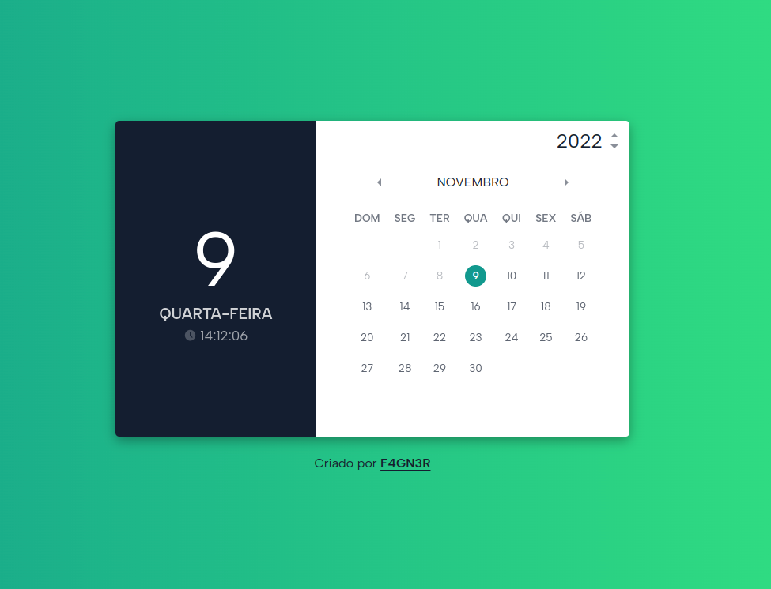

## Calendar UI

	
   
  
  

   

## 💻 Projeto

Um exemplo de calendário construido apenas com HTML, CSS e Javascript Puro.

## ✨ Tecnologias

- [x] [HTML5](https://developer.mozilla.org/pt-BR/docs/Web/HTML)
- [x] [CSS3](https://developer.mozilla.org/pt-BR/docs/Web/CSS)
- [x] [Javascript](https://developer.mozilla.org/pt-BR/docs/Web/JavaScript)
- [x] [GoogleFonts](https://fonts.google.com/)

## 🛠 Features

- Exibição do dia atual;
- Exibição do dia da semana;
- Exibição de relógio HH:MM:SS;
- Exibição de feriados.
- Exibição de pontos facultativos.
- Exibição de datas futuras e passadas;
- Destaque no calendário para o dia atual;
- Destaque no calendário para dias no passado;
- Destaque no calendário para finais de semana;
- Destaque no calendário para feriados e pontos facultativos;

## 🚀 Executando o projeto

1. Abrir o arquivo `index.html` no browser de sua preferência ou execultar com a extensão _Live Server_
